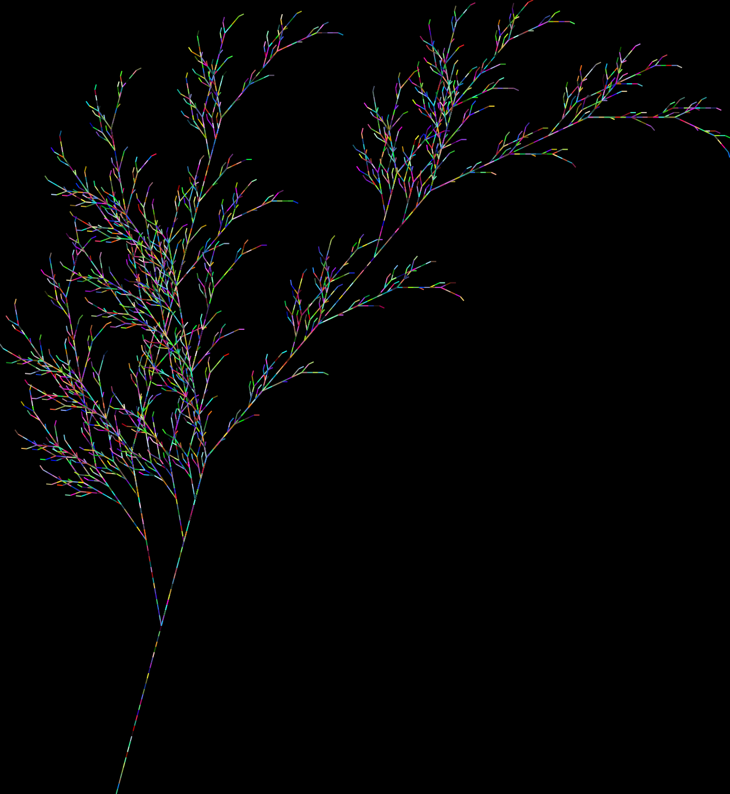
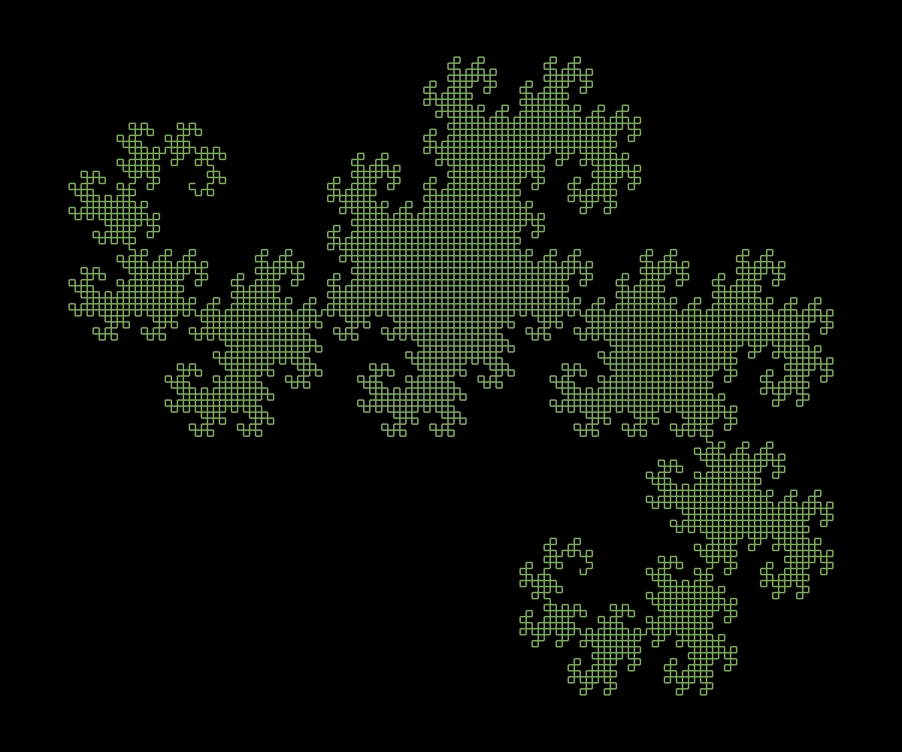

# Lindenmayer system

The renderer named `Renderer::TurtleNormal` doesn't have headless mode, it means during the execution you will see the entire rendering process (turtle traces).

## How to build and run ?

1. Install the dependencies
    - `cargo`

## Usage examples

### Plant

```rust
use lindenmayer::{
    lindenmayer::Lindenmayer,
    models::{
        rules_model::Rules,
        action_model::Action
    },
    action::Do,
    renders::render::Renderer,
    state::{
        ScreenPosition,
        SizeType
    }
};

fn main() {
    let renderer = Renderer::TurtleNormal(SizeType::Auto);

    Lindenmayer::new(renderer)
        .set_consts("c+-[]")
        .set_rule('X', "cF+[[X]-X]-cF[-cFX]+X")
        .set_rule('F', "cFcF")
        .set_action('F', Do::Forward(10.0))
        .set_action('[', Do::Save)
        .set_action(']', Do::Restore)
        .set_action('-', Do::Right(25.))
        .set_action('+', Do::Left(25.))
        .set_action('c', Do::ColorRandom)
        .set_axiom("+++cX")
        .set_figure_pos(ScreenPosition::Center)
        .set_background(0., 0., 0.)
        .iterate(6)
        .draw()
        .save_svg("img/plant.svg");
}
```

### Result



### Dragon

```rust
use lindenmayer::{
    lindenmayer::Lindenmayer,
    models::{
        rules_model::Rules,
        action_model::Action
    },
    action::Do,
    renders::render::Renderer,
    state::{
        ScreenPosition,
        SizeType
    }
};

fn main() {
    let size = SizeType::Custom(400., 400.);
    let renderer = Renderer::TurtleNormal(size);

    Lindenmayer::new(renderer)
        .set_consts("c+-")
        .set_rule('F', "F+G")
        .set_rule('G', "F-G")
        .set_action('F', Do::Forward(5.0))
        .set_action('G', Do::Forward(5.0))
        .set_action('-', Do::Right(90.))
        .set_action('+', Do::Left(90.))
        .set_action('c', Do::ColorRandom)
        .set_axiom("cF")
        .set_figure_pos(ScreenPosition::Center)
        .set_background(0., 0., 0.)
        .iterate(13)
        .draw()
        .save_svg("img/dragon.svg");
}
```

### Result



### Gosper

```rust
use lindenmayer::{
    lindenmayer::Lindenmayer,
    models::{
        rules_model::Rules,
        action_model::Action
    },
    action::Do,
    renders::render::Renderer,
    state::{
        ScreenPosition,
        SizeType
    }
};

fn main() {
    let render = Renderer::TurtleNormal(SizeType::Auto);

    Lindenmayer::new(render)
        .set_consts("c+-")
        .set_rule('A',"A-B--B+A++AA+B-")
        .set_rule('B', "+A-BB--B-A++A+B")
        .set_action('A', Do::Forward(10.0))
        .set_action('B', Do::Forward(10.0))
        .set_action('-', Do::Right(60.))
        .set_action('+', Do::Left(60.))
        .set_action('c', Do::PenColor(173., 40., 49.))
        .set_axiom("cA")
        .set_figure_pos(ScreenPosition::Center)
        .set_background(0., 0., 0.)
        .iterate(5)
        .draw()
        .save_svg("img/gosper.svg");
}
```

### Result


