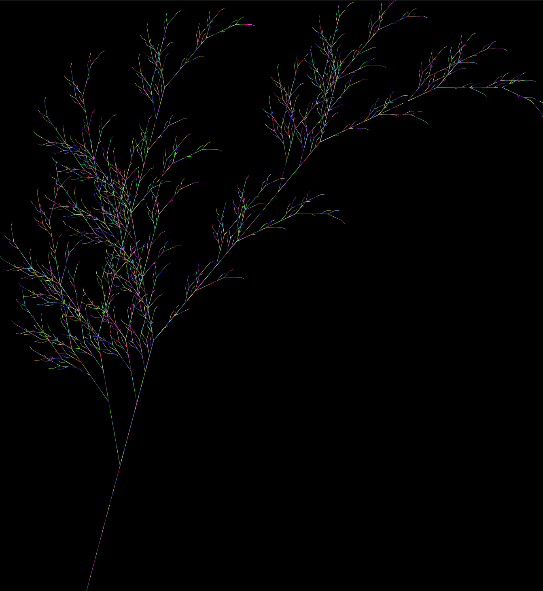
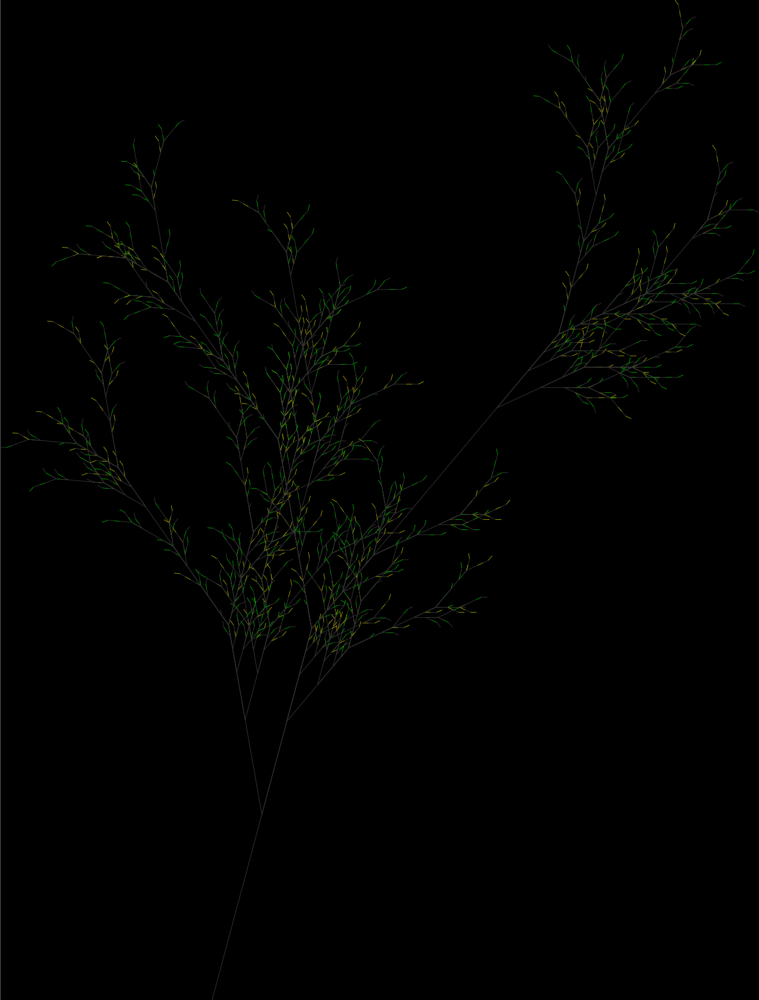

# Lindenmayer system

The renderer named `Renderer::TurtleNormal` doesn't have headless mode, it means during the execution you will see the entire rendering process (turtle traces). Instead you could use `Renderer::TurtleHeadless` if you only need an output file.

## How to build and run ?

1. Install the dependencies
    - `cargo`

## Usage examples

### Plant

```rust
use lindenmayer_graphic::{
    lindenmayer::Lindenmayer,
    models::{
        rules_model::Rules,
        action_model::Action
    },
    action::Do,
    renders::renderer::Renderer,
    state::{
        ScreenPosition,
        SizeType
    }
};

fn main() {
    let renderer = Renderer::TurtleHeadless(SizeType::Auto);

    Lindenmayer::new(renderer)
        .set_consts("c+-[]")
        .set_rule('X', "cF+[[X]-X]-cF[-cFX]+X")
        .set_rule('F', "cFcF")
        .set_action('F', Do::Forward(10.0))
        .set_action('[', Do::Save)
        .set_action(']', Do::Restore)
        .set_action('-', Do::Right(25.))
        .set_action('+', Do::Left(25.))
        .set_action('c', Do::ColorRandom)
        .set_axiom("+++cX")
        .set_figure_pos(ScreenPosition::Center)
        .set_background(0., 0., 0.)
        .iterate(6)
        .draw()
        .save_svg("img/plant.svg");
}
```

### Result



### Stochastic plant

```rust
use std::fmt::format;

use lindenmayer_graphic::{
    lindenmayer::Lindenmayer,
    models::{
        rules_model::Rules,
        action_model::Action
    },
    action::Do,
    renders::renderer::Renderer,
    state::{
        ScreenPosition,
        SizeType
    },
    rule::Rule
};

fn tree(output: &str) {
    let renderer = Renderer::TurtleHeadless(SizeType::Auto);

    Lindenmayer::new(renderer)
        .set_consts("cgy+-[]")
        .set_rule(
            'X',
            vec![
                Rule::new("cF+[[X]-X]-gF[-cFX]+X", 33),
                Rule::new("gF-[[X]+X]+cF[+gFX]-X", 33),
                Rule::new("yF-[[X]+X]+cF[+yFX]-X", 33)
            ]
        )
        .set_rule('F', "cFcF")
        .set_action('F', Do::Forward(10.0))
        .set_action('[', Do::Save)
        .set_action(']', Do::Restore)
        .set_action('-', Do::Right(25.))
        .set_action('+', Do::Left(25.))
        .set_action('g', Do::PenColor(0., 150., 0.))
        .set_action('y', Do::PenColor(150., 150., 0.))
        .set_action('c', Do::PenColor(50., 50., 50.))
        .set_axiom("+++cX")
        .set_figure_pos(ScreenPosition::Center)
        .set_background(0., 0., 0.)
        .iterate(6)
        .draw()
        .save_svg(output);
}

fn main() {
    for i in 0..5 {
        let name = format!("tree_{}.svg", i);
    
        tree(&name);
    }
}

```

### Results





### Dragon

```rust
use lindenmayer_graphic::{
    lindenmayer::Lindenmayer,
    models::{
        rules_model::Rules,
        action_model::Action
    },
    action::Do,
    renders::renderer::Renderer,
    state::{
        ScreenPosition,
        SizeType
    }
};

fn main() {
    let size = SizeType::Custom(400., 400.);
    let renderer = Renderer::TurtleHeadless(size);

    Lindenmayer::new(renderer)
        .set_consts("c+-")
        .set_rule('F', "F+G")
        .set_rule('G', "F-G")
        .set_action('F', Do::Forward(5.0))
        .set_action('G', Do::Forward(5.0))
        .set_action('-', Do::Right(90.))
        .set_action('+', Do::Left(90.))
        .set_action('c', Do::ColorRandom)
        .set_axiom("cF")
        .set_figure_pos(ScreenPosition::Center)
        .set_background(0., 0., 0.)
        .iterate(13)
        .draw()
        .save_svg("img/dragon.svg");
}
```

### Result


